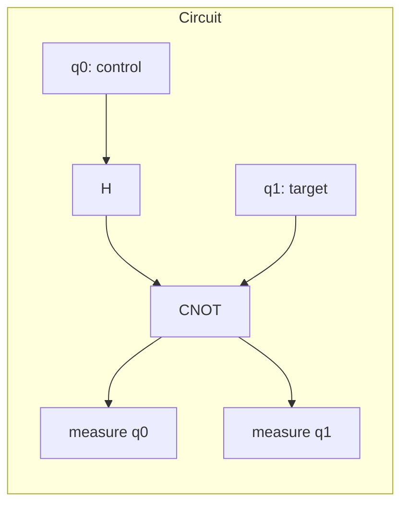

# Quantum Gates

Gates are how you manipulate qubit states. Unlike classical logic gates, quantum gates must be **reversible** — represented by unitary matrices.

## The Hadamard gate (H)

Puts a qubit into equal superposition:

\[
H = \frac{1}{\sqrt{2}}\begin{pmatrix} 1 & 1 \\ 1 & -1 \end{pmatrix}
\]

\[
H|0\rangle = \frac{1}{\sqrt{2}}(|0\rangle + |1\rangle)
\]

## The CNOT gate (entanglement)

Flips the target qubit only if the control qubit is `1`. This is how entanglement gets created between two qubits.



```python
from qiskit import QuantumCircuit

qc = QuantumCircuit(2, 2)
qc.h(0)        # superposition on control qubit
qc.cx(0, 1)    # entangle control and target
qc.measure([0, 1], [0, 1])

print(qc.draw())
```

!!! tip "What to notice"
    After this circuit, measuring q0 and q1 always gives matching results (`00` or `11`), never `01` or `10` — even though each individual qubit's outcome looks random. That correlation *is* entanglement.

## Gate cheat sheet

| Gate | Symbol | Effect |
|------|--------|--------|
| X | Pauli-X | Bit flip (classical NOT) |
| Z | Pauli-Z | Phase flip |
| H | Hadamard | Creates superposition |
| CNOT | Controlled-X | Entangles two qubits |
| T | T-gate | π/4 phase rotation |

---

**← Back to [Qubits & Superposition](qubits.md)**
