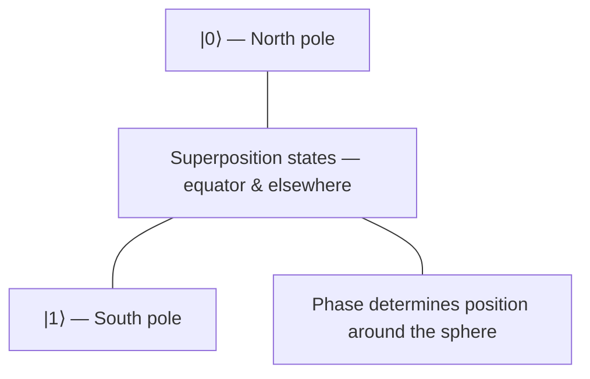

# Qubits & Superposition

## The state of a qubit

A classical bit is `0` or `1`. A qubit's state is a vector in a 2D complex space:

\[
|\psi\rangle = \alpha|0\rangle + \beta|1\rangle
\]

where \(\alpha\) and \(\beta\) are complex numbers satisfying:

\[
|\alpha|^2 + |\beta|^2 = 1
\]

!!! warning "Common misconception"
    "Superposition" doesn't mean the qubit is secretly 0 *and* 1 at the same time. It means the qubit's state is a combination of both basis states, and measurement collapses it to one outcome with a probability set by \(\alpha\) and \(\beta\).

## Measurement

Measuring \(|\psi\rangle\) in the standard basis gives:

- `0` with probability \(|\alpha|^2\)
- `1` with probability \(|\beta|^2\)

```python
from qiskit import QuantumCircuit
from qiskit_aer import AerSimulator

qc = QuantumCircuit(1, 1)
qc.h(0)          # put qubit into superposition
qc.measure(0, 0)

sim = AerSimulator()
result = sim.run(qc, shots=1000).result()
print(result.get_counts())
# roughly {'0': 500, '1': 500}
```

## Bloch sphere intuition

A single qubit's state can be visualized as a point on the surface of a sphere:



The poles are the classical states. Everything else on the sphere's surface is a valid superposition — phase and amplitude both matter, which is why two states can have the same measurement probabilities but behave differently in a circuit.

---

**Next: [Quantum Gates →](gates.md)**
